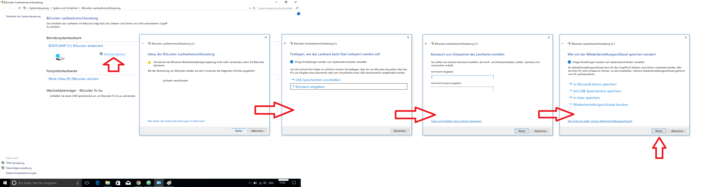
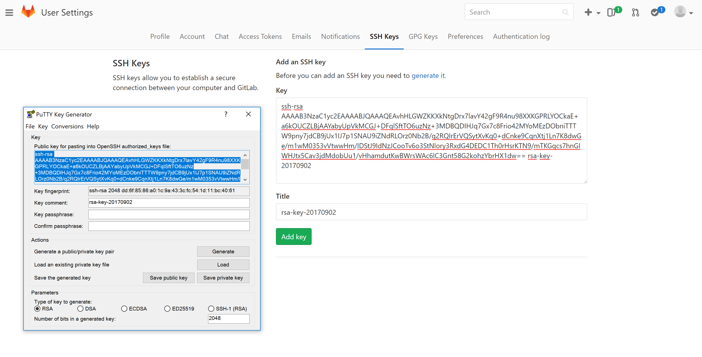
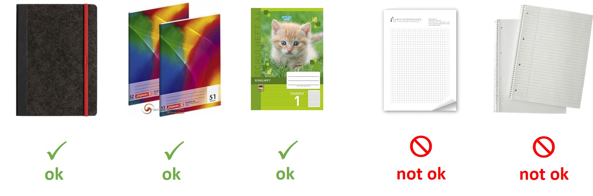

# Prepare your work environment

Help us to improve this guide. Practice the GitLab workflow by improving or by adding something to this [guide](https://gitlab.com/StudentProjects/guide).

!!! hint
    Every student of our team should contribute with at least **two commits** to this guide to make it better and to extend it. The easiest way is to look for problems **you** have with our onboarding process. Identify missing or incomplete pieces in this guide and improve it using the forking workflow. **Additionally**, choose one issue from the issue tracker of this project and solve it. Thank you 👍

If you don't have the access to this [guide](https://gitlab.com/StudentProjects/guide) please ask to your supervisor for a permission.

# System requirements

In order to install and use our tools, you need one of the following platforms:
- Windows 10 (Intel 64-bit) or higher
- Ubuntu 18.04 (Intel 64-bit) or higher

# Secure your laptop or notebook computer

Some of you will be provided with a notebook computer. This happens if you are an experienced member of the student team or if you are working remotely.

We give you the maximum of flexibility to configure the computer to your needs. So please act responsibly and:

- Install a clean Windows 10 or Linux Ubuntu operating system.
- Encrypt the HDD and/or all partitions. This is necessary to protect our and your work in the case of computer loss.
  - Windows: use Bitlocker or [VeraCrypt](https://www.veracrypt.fr/en/Home.html)
  - Linux: use [full harddrive encyption](https://help.ubuntu.com/community/Full_Disk_Encryption_Howto_2019)
  - Windows / Ubuntu dual boot: [Bitlocker and encrypted Ubuntu system partition](https://www.mikekasberg.com/blog/2020/04/08/dual-boot-ubuntu-and-windows-with-encryption.html)
- fully encrypt your USB flash drives and external USB harddisks as well
- backup your system and data regularly (daily)

Setup Bitlocker on Windows 10:
* go to control Panel -> system and security -> BitLocker Drive Encryption
* select the drive you want to encrypt
* enter a password
* <b>important: backup your recovery key</b>



## Install the following tools

This also applies if your use your own computer.

### Windows
* IDE for software development and debugging: Visual Studio Enterprise Edition 2019 \(via [Microsoft Imagine Premium-Portal](https://www.tu-chemnitz.de/urz/software/dreamspark.php) of TU Chemnitz\). That link will take you to Azure developer tools website. Provide your TUC email address and confirm registration. Then you can download the Visual Studio Installer. Currently only 2019 version is available.
* Git client: [SourceTree](https://de.atlassian.com/software/sourcetree) or [Visual Studio Code](https://code.visualstudio.com/)
* editing markup \(.md\) files: [Atom editor](https://atom.io)
  * install the following packages for the Atom editor
    * Markdown Preview Plus
    * Markdown Preview Plus Opener
    * Markdown Scroll Sync
* editing markup \(.md\) files: [Visual Studio Code](https://code.visualstudio.com/)
  * install the following extensions
    * GitLab Workflow
    * markdownlint
* if you need to write JavaScript code and you don't have a good JS IDE available yet, consider
  * Visual Studio Ultimate Edition or
  * [Webstorm](https://www.jetbrains.com/webstorm/)
* Install [CMake](https://cmake.org/)
* Install [Git](https://git-scm.com/)

### Linux
* IDE for software development and debugging: [CLion](https://www.jetbrains.com/clion/) \(free for academic users\)
  * It is recommended to install/enable these additional plugins:
    * "Markdown" (syntax highlighting + preview for .md files)
    * "YAML" (syntax highlighting for .yaml files)
* [Webstorm](https://www.jetbrains.com/webstorm/) (if you need to write JavaScript)
    * most CLion plugins work in Webstorm as well
* editing markup \(.md\) files: CLion/Webstorm (see above) or [Atom editor](https://atom.io) (see Windows section for details)
* Git client: A console-based Git client should already be on your system. (called `git`)  
  If you want a GUI, you can try installing `git-gui` or use the CLion plugin "Git Integration". (You do *not* need the GitHub or GitLab plugins.)
* Use your system's package manager to install *CMake*. There is a curses based terminal GUI and a Qt based GUI.

## Prepare for GitLab access

!!! hint
    Our team uses Git repositories from **two** different hosts:: **gitlab.hrz.tu-chemnitz.de** and **gitlab.com**. The gitlab host setups described below need to be done for both hosts.

### Windows 10: Generate SSH keys for gitlab.hrz.tu-chemnitz.de access

* open a windows powershell
* type `ssh-keygen -t ed25519 -C "ssh-key-TUC"`
* the command prompt will ask for a file name and passphrase: keep it empty and press enter until you see the following statement;
* `Your identification has been saved in C:\Users\...\.ssh\id_ed25519`
* cd into this folder
* rename the files `id_ed25519` and `id_ed25519.pub` to `id_ed25519_gitlab_tuc` and `id_ed25519_gitlab_tuc.pub`
* this can be done via
```
ren id_ed25519 id_ed25519_gitlab_tuc
ren id_ed25519.pub id_ed25519_gitlab_tuc.pub
```

### Windows 10: Generate SSH keys for gitlab.com access

* open a Windows PowerShell
* type `ssh-keygen -t ed25519 -C "ssh-key-gitlab_com"`
* the command prompt will ask for a file name and passphrase: keep it empty and press enter until you see the following statement;
* `Your identification has been saved in C:\Users\...\.ssh\id_ed25519`
* cd into this folder
* rename the files `id_ed25519` and `id_ed25519.pub` to `id_ed25519_gitlab_com` and `id_ed25519_gitlab_com.pub`
* this can be done via
```
ren id_ed25519 id_ed25519_gitlab_com
ren id_ed25519.pub id_ed25519_gitlab_com.pub
```

### Windows 10: Configure your SSH

* open a Windows PowerShell
* cd into the `.ssh` folder (was at `C:\Users\...\.ssh`)
* create an empty text file `config` (**without** a file extension) and this can done via

```
echo "This is sample text" > config
```
* open the file with a text editor and type

```

# gitlab.hrz.tu-chemnitz.de account
Host gitlab.hrz.tu-chemnitz.de
 HostName gitlab.hrz.tu-chemnitz.de
 User INSERT-YOUR-USERNAME-HERE
 IdentityFile ~/.ssh/id_ed25519_gitlab_tuc

# gitlab.com account
Host gitlab.com
 HostName gitlab.com
 User INSERT-YOUR-USERNAME-HERE
 IdentityFile ~/.ssh/id_ed25519_gitlab_com 
```

* the user names are your user handle for the respective gitlab instance, it should look something like *abcd*
* save and close the file (**without** a file extension). Make sure to use "UTF-8" encoding system when editing the file, this can be done using Notepad++.

----

* Deploy your public keys:
  * for gitlab.hrz.tu-chemnitz.de (file `id_ed25519_gitlab_tuc.pub`) [here](https://gitlab.hrz.tu-chemnitz.de/-/profile/keys)
  * for gitlab.com (file `id_ed25519_gitlab_com.pub`) [here](https://gitlab.com/-/profile/keys).
  
!!! hint
    Prefer notepad++ or notepad to view the files. The files contain both the key and the key title. Make sure to paste the key under key section and title under title section.

**Ignore** the statement "Before you can add an SSH key you need to generate it." You just created this key.

### Windows 10: Test your SSH key setup

* open Windows Powershell
* type `ssh -T git@gitlab.hrz.tu-chemnitz.de`
* agree to add *gitlab.hrz.tu-chemnitz.de* to the list of trusted hosts
* Run the above command once more, and you should only receive a *Welcome to GitLab, @username!* message.

* type `ssh -T git@gitlab.com`
* agree to add *GitLab.com* to the list of trusted hosts
* Run the above command once more, and you should only receive a *Welcome to GitLab, @username!* message.

If the welcome message doesn’t appear, run SSH’s verbose mode by replacing `-T` with `-vvvT` to understand where the error is.

----------

Source and more detailed information: https://docs.gitlab.com/ee/ssh/

### Linux: Generate SSH keys for GitLab access

* Create a public/private key pair using the ssh-keygen commandline tool.  
  It is recommended to use the default paths for the keys. If you want to use custom key paths, look [here](https://gitlab.hrz.tu-chemnitz.de/help/ssh/README#working-with-non-default-ssh-key-pair-paths).
* Deploy your public SSH key \(usually stored in ~/.ssh/id\_rsa.pub\) [here](https://gitlab.hrz.tu-chemnitz.de/profile/keys).
* Additionally, specifically on Ubuntu, it might be necessary to do `ssh-add`. Look [here](https://stackoverflow.com/questions/6167905/git-clone-through-ssh).

## Save the public SSH Key in GitLab

* Go to [GitLab.hrz](https://gitlab.hrz.tu-chemnitz.de/) as well as to [Gitlab.com](https://gitlab.com/) and Log in. The group maintains repositories on both sites. Therefore the remaining Gitlab setup instructions in this chapter apply to **both** sites (the user interfaces are the same)
* Click in the upper right corner and go to Settings
* In your User Settings go to the column SSH Keys
* paste your public SSH Key and add a Title
* click on "Add Key" to confirm



## Additional Steps
* Install Miniconda \(based on Python 3\) by following the [Conda How-To](https://draive.com/link_dev/guide/01_Conda_Setup/) and install the most important dependencies.
* Activate your [GitLab account for TU Chemnitz](https://gitlab.hrz.tu-chemnitz.de). Send an email to your supervisor to inform him that you have activated your GitLab account. Include your URZ user name (your supervisor needs it to give you access to repositories).
* [Create an avatar](http://avatarmaker.com/) for your GitLab account. Add it to your GitLab [profile](https://gitlab.com/-/profile).

## Prepare for software version control

**please read and follow the instructions carefully!**

[The GitLab workflow used by our team...](working-with-GitHub.md)

# Meeting and communication with your supervisor

Meet your supervisor regularly. If you have a meeting,

* Always bring your paper notebook. (see below)
* Always bring your laptop.
* Be well prepared to explain what you were supposed to do, what the results are, how you solved problems and what the next steps are.
* Do not be late. If you realise that you will be late, call your supervisor immediately and/or send a signal message or SMS \(see below\).

In addition to email most of our team uses encrypted messaging. Please consult your supervisor which encryped messenger to use - or just install both :)

- Primary: [Riot - open source team collaboration tool](https://about.riot.im/)
- Backup: [Signal messenger](https://whispersystems.org/)

## Write down all your findings

Please use an old-school paper notebook \(minimum size: DIN A5\) to write down your tasks, findings, ideas, results. Do not use single sheets of paper. They get lost easily. Have this notebook ready during your work and in our meetings.




# How to develop software with less pain

Read the [PC3](../content-ops/PC3.md) file which describes the rules of software development our team chose to follow.

# Recommended programming books

We are a polyglot programming team. We are OK with using multiple languages and we try to use the right tool for the job.

Since we focus on algorithm development, the C++ language is our primary choice for fast and powerful code.

Just "googling" is not enough to become a good programmer! Read some good books:

**Basic**

* Programming: Principles and Practice Using C++ \(Bjarne Stroustrup\)

**Advanced**

* Effective C++: 55 Specific Ways to Improve Your Programs and Designs \(Scott Meyers\)  
\(read this book _before_ you read "Effective Modern C++"\)

* Effective Modern C++: 42 Specific Ways to Improve Your Use of C++11 and C++14 \(Scott Meyers\)

* Design Patterns \(Erich Gamma\) _and_ [here](https://en.wikibooks.org/wiki/C%2B%2B_Programming/Code/Design_Patterns)

# How to do research

You are working in a research lab now. Bill Freeman's very true article describes what that means:

[How to do research, March 6, 2013 Bill Freeman, CSAIL, MIT](http://people.csail.mit.edu/billf/publications/How_To_Do_Research.pdf)

# Cross-Cultural communication

Are you wondering about the German business and working culture? This guide from the _Deutsche Gesellschaft für Internationale Zusammenarbeit \(GIZ\)_ provides some insights:

[Cross-Cultural Management: How to Do Business with Germans - A Guide –](http://www.asprea.org/imagenes/GIZ-_How_to_do_business_with_Germans_Kavalchuk-angles-1359942678515.pdf)

# FAQ

**Q:** I have seen that some students do not follow the userguide. For example some do not have an avatar. How should I proceed in that way? Should I follow the userguide or should I do what other students are doing / not doing?

**A:** Please follow the userguide. If you don't understand some contents, ask your supervisor and help to improve the guide.

If other students behave different from the workflow described in the userguide ask them why they do so. If they provide a reasonable explanation, discuss with your supervisor.

Some students do not follow the userguide because they do not know it or they decided to ignore it. Do not worry about it.

In order to become smarter, we do not recommend you to ignore the hints we are providing in the userguide ;)

The userguide is the only source of truth during the onboarding process.

**Q:** My work follows the *target condition* (TC) method. Since I work very hard, I do not have time to update the target condition. What should I do?

**A:** Updating the target condition is part of your work and the target condition itself. You should take into account the additional time when estimating your due date. The past has shown that successful students need only 5..10 minutes to update their target condition.

**Q:** What should I do when I realize that I will miss the due date of my target condition?

**A:** When you realize that you will miss your due date, please do as follows:

- describe in the issue why you will miss the due date **before the due date has passed**
  - why was your estimate wrong, what happened
    - pro tip: try to be honest to yourself: if you have bad time management, say it ... and improve it ;)
  - what will you do to have a better estimate next time
  - estimate a new due date and update the TC issue
  - inform your supervisor that you will miss the due date and that you have updated the issue

**Q:** I do not know how to estimate the due date. What should I do?

**A:** Every student in our team should be able to estimate the amount of time he/she needs to reach a target condition (finish a task). If you have problems estimating the time, choose a smaller target condition. A one day duration is a good start.
