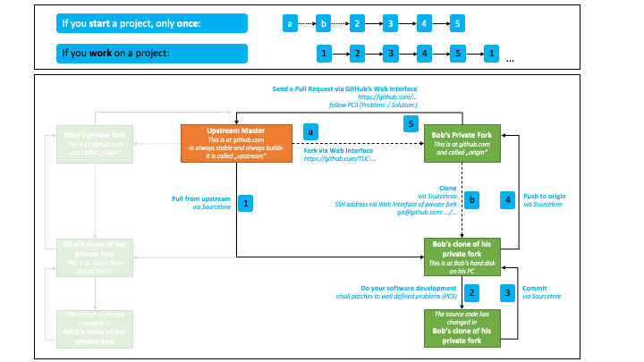
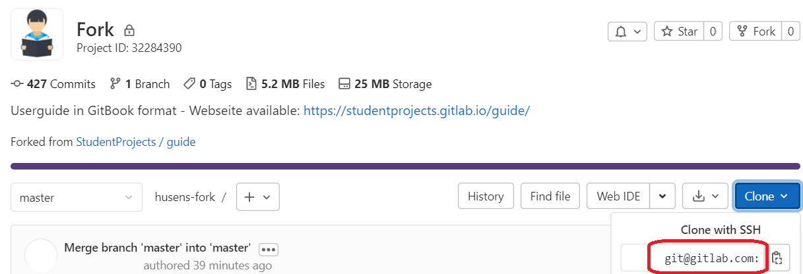
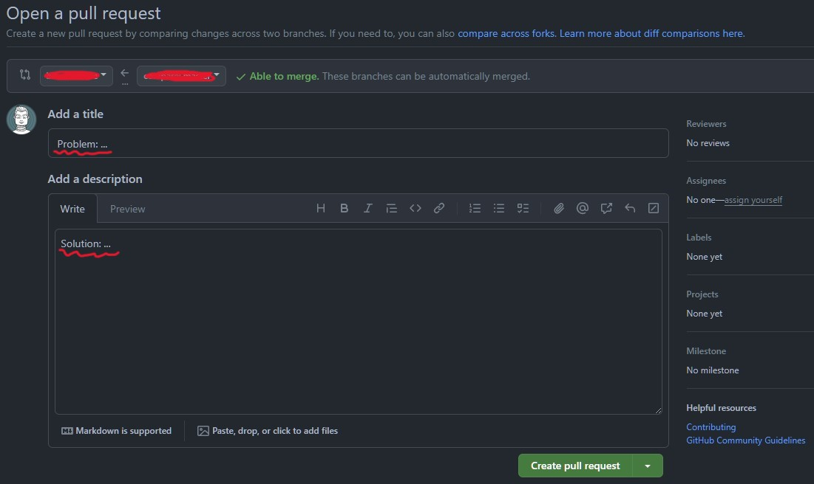
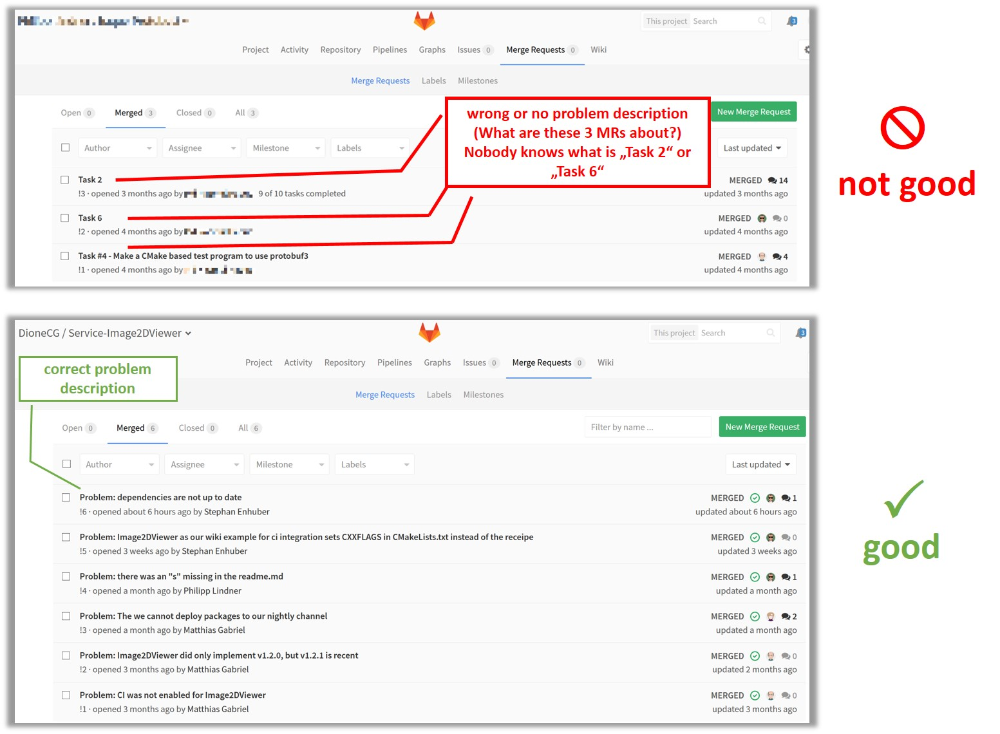
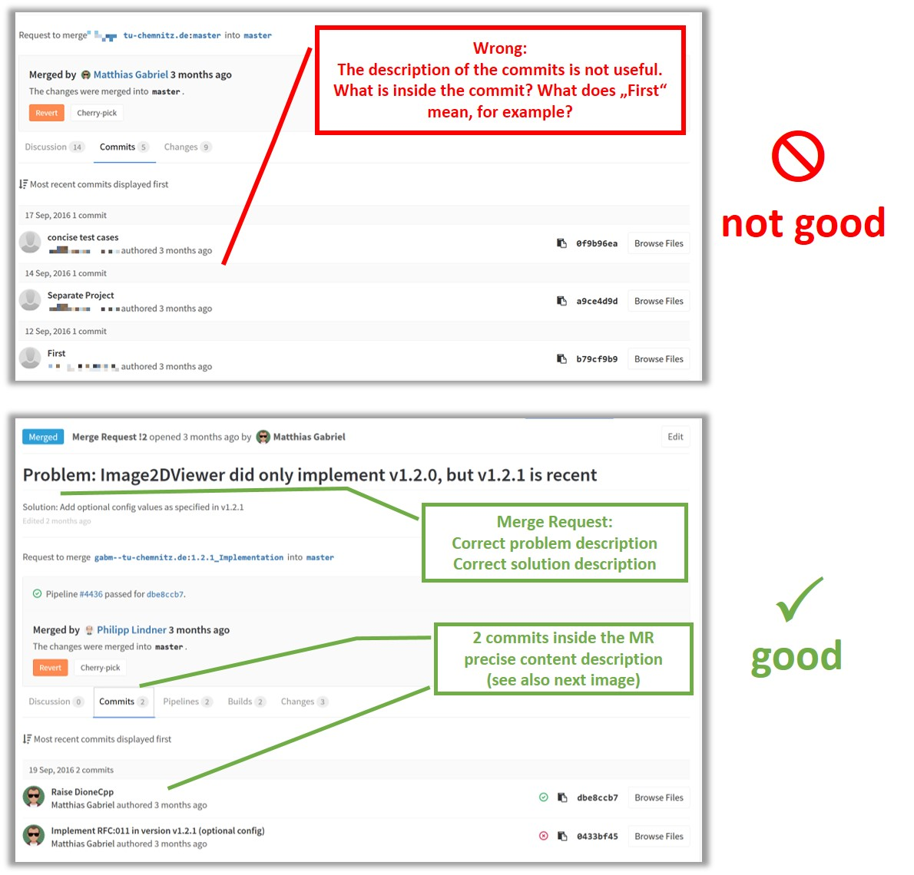
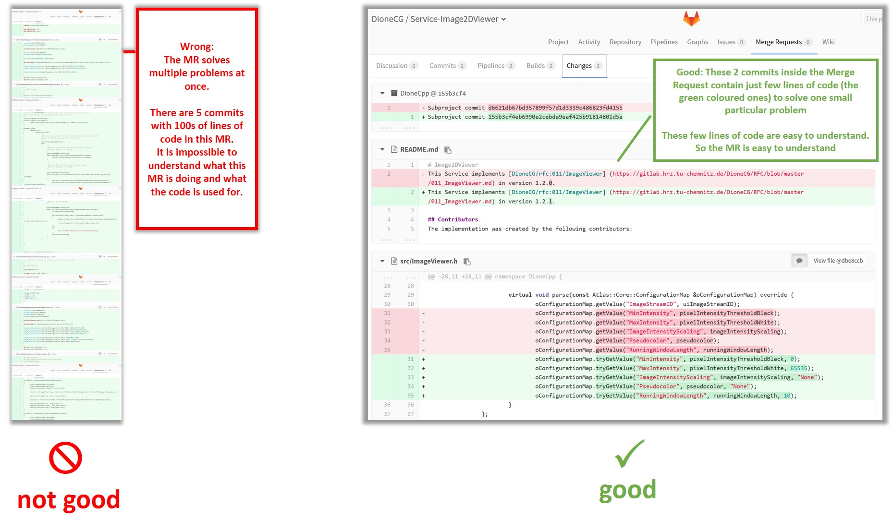
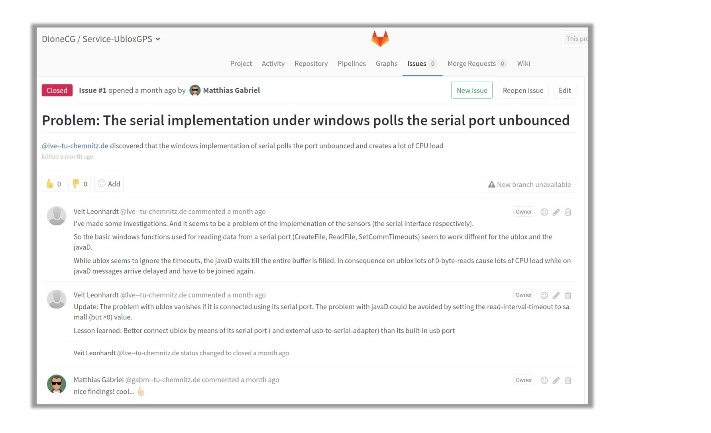

# Working with GitHub

**GitHub, Inc**. is a platform and cloud-based service for software development and version control using **Git**, allowing developers to store and manage their code. It provides the distributed version control of **Git** plus access control, bug tracking, software feature requests, task management, continuous integration, and wikis for every project.

**Git** is a version control system (VCS) for tracking changes in computer files and coordinating work on those files among multiple people. It is primarily used for software development. [Source: Wikipedia].

## How to do good source control

* version control your source code
* read  https://www.troyhunt.com/10-commandments-of-good-source-control/
 * focus on 2-6 and 8-9
 * ignore 1, 7, 10 for now

## Tools and IDE integration

### Windows
Most of our colleagues use [SourceTree](https://www.sourcetreeapp.com/) as version control GUI. (Also available for Mac OS X.)

Sourcetree is a sofware solution still recommended for windows to provide a git graphical interface. It allows to connect to git repositories to easily perform all necessary git related tasks. it is a simple and user friendly which makes life of git users easier.  

You are free to use other tools like [command line](https://git-scm.com/book/en/v2/Getting-Started-The-Command-Line) or [TortoiseGit](https://tortoisegit.org/) but we can not provide support for these tools.


### Linux
Most Linux users use the Git [command line](https://git-scm.com/book/en/v2/Getting-Started-The-Command-Line) or the [git client for CLion](https://www.jetbrains.com/help/clion/using-git-integration.html)

## Forking workflow

We use "forking workflow." Please read
- https://www.atlassian.com/git/tutorials/comparing-workflows/forking-workflow
- http://blog.scottlowe.org/2015/01/27/using-fork-branch-git-workflow/




- Fork the repository which was given to you by your supervisor (later called "upstream") using the web interface. A valid fork name should not include special characters e.g. " ' ".

- This new fork will be your personal fork of the upstream project. This new fork will be called your "origin".

- Clone your personal fork (origin) to your harddrive using Git/Sourcetree. The SSH Path to your origin can be found in the web interface (as shown in the following screenshot). This will be your working directory. Please commit and push regularily!

!!! info
    If you are using <b>git-bash</b>, use insert button to paste the SSH path after copying it to clipboard.



- To submit your code to the upstream repository, create a pull request from your personal fork in the web interface

- if you need to update your personal fork from the project it was created from, do a "pull from upstream" --> https://help.github.com/articles/merging-an-upstream-repository-into-your-fork/

## Attention

!!! danger
    Never use spaces in folder or filenames.


## Commits and pull requests
Please follow [PC3](../content-ops/PC3.md) for commits and pull requests.

<b>A proper pull request MUST follow *Problem:/Solution:* syntax and solve **only one small** problem.</b>

<b>The title of PR MUST contain a definition of the current problem ("Problem: ..."). The proposed solution ("Solution: ...") MUST be written in the description field of PR.</b>

<b>! Important Note: Merging is only done by SUPERVISORS!
That means: when you're asked to upload files or update a repository, DO NOT MERGE, but only create a Pull Request and assign it to your supervisor so that they can merge it after checking it. So please only follow the [WORKFLOW](../assets/github_workflow_beginner_01.png) mentioned previously!</b>




## Bad and good examples

### Pull Requests with wrong title and too much code (see below):



### Commits with unclear content description:



### Commits of PR solving multiple problems and PR with too much code:




#### Pushing to a repository with 2FA(2 Factor Authentication)
While pushing to a repository on which 2FA is enabled, you will be asked for a Personal Access Token. The procedure on how to create a PAT is described [here](https://docs.github.com/en/authentication/keeping-your-account-and-data-secure/managing-your-personal-access-tokens). Once a PAT is created, please save the PAT somewhere *_safe_* (you will not be able to view it a second time) and use the same instead of your password.


## Issues and issue tracker

Use the issue tracker to discuss issues and ideas with your colleagues.

Avoid to discuss issues via Email (others can not join easily).

Start each issue with "Problem:" in the title and describe the problem in the description.

### Example for good issue handling:


## Provide your real full name and create an avatar

provide your real full name in your profile settings.

-https://docs.github.com/en/account-and-profile/setting-up-and-managing-your-github-profile/customizing-your-profile/personalizing-your-profile#changing-your-profile-name

Please give your GitHub profile an Avatar or suitable photo.

-https://docs.github.com/en/account-and-profile/setting-up-and-managing-your-github-profile/customizing-your-profile/personalizing-your-profile#changing-your-profile-picture

In computing, an avatar is the graphical representation of the user or the user's alter ego or character.

There are Avatar generators available:
-http://avatarmaker.com/
-http://www.pcworld.com/article/172320/article.html


# FAQ

 **Q:** When and how often should I commit my code?

 **A:** Your first commit is done right after you have created the basic frame for your code. For example right after your IDE has created the basic code.

 After that you should commit regularly. Usually this is done every some hours.

 You can not commit too often!

 -----

**Q:** What do you mean with Problem/Solution statement according to [PC3](../content-ops/PC3.md) in the pull requests?

**A:** A pull request contains a solution to a **single** and **small** problem. You need to name the problem and its solution in the PR.

A problem description does **not** start with *to*.

Just think about how you would continue this sentence: *My problem is, that ...*

**Example - incorrect:**
```
Problem: to make a function which prints to console
Solution: write a cout function
```

**Example - correct:**
```
Problem: the result of the mean algorithm needs to be shown to the user
Solution: add cout function whichs prints the mean algorithm result to console
```

```
Problem: I do not know whether algorithm a is faster than algorithm b
Solution: compare the processing time of algorithm a and b
```

```
Problem: I need a starter app for the new project
Solution: create one
```

----

**Q:** What is *upstream*?

**A:** *Upstream* describes the origin of your personal fork. This (the *upstream*) is the master everybody is merging their work into. You only pull from upstream, you never push to upstream directly.

**SourceTree:** (Windows only)
- to pull from upstream you need to define upstream in SourceTree first
- go to `Repository` -> `Repository Settings`
- you should see a path to your personal fork, named *origin*
- click `Add`
- in `Remote Name` type *upstream*
- in `URL / Path` type the URL of the project you created (forked) your personal fork from
- click `OK`


- if you want to pull from upstream select `Pull`
- choose *upstream* in `Pull from remote`

**Git command line:** (Windows/Linux)
- Type `git remote -v` to view the URL of your personal fork, named *origin*.
- Add the upstream using this command:
    ```
    git remote add upstream <URL-of-upstream-project>
    ```


- You can use this command in order to pull from upstream into your local repository:
    ```
    git pull upstream master
    ```

---

**Q:** HTTPS access to a repository does not seem to work for TUC hosted repositories?

**A:** Since the URZ decided to disable HTTPS access, we have to use Git's defaults authentication: SSH.

Unfortunately this process, which is standard in Linux, is not very well supported under Windows at the moment. This situation is about to change in upcoming versions of Windows 10/Visual Studio 2015 Update 3.  
Until then we will use SourceTree or TortoiseGit with Putty SSH keys and the Tgit plugin for Visual Studio.
